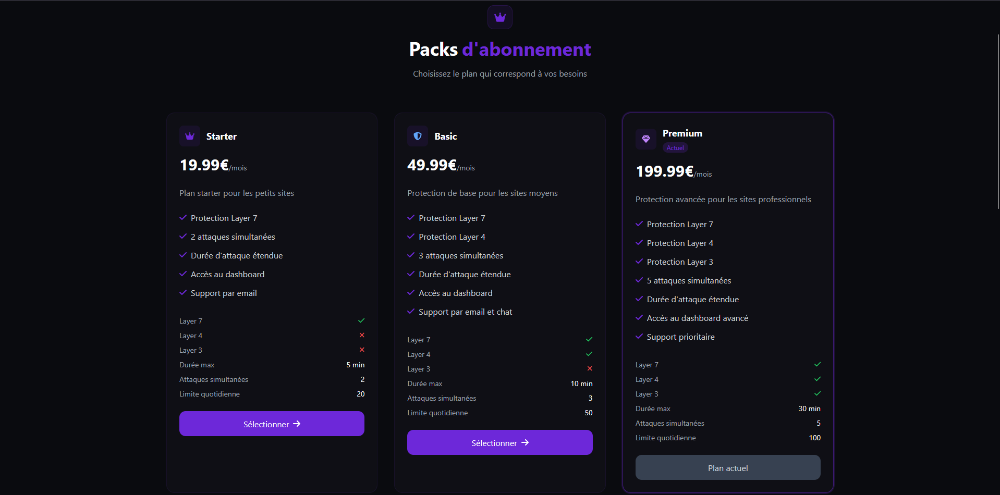

# 🚀 Stellar DDoS Testing Platform


A professional, high-performance DDoS stress testing platform for network administrators and security professionals. Test your infrastructure's resilience against various attack vectors.

## ✨ Features

- 🔄 **Multi-layer Testing**: Support for Layer 3, Layer 4, and Layer 7 attacks
- 🔒 **Secure Auth**: Role-based access control with subscription tiers
- 📊 **Real-time Statistics**: Live tracking of attack metrics and connections
- 🌐 **Advanced Targeting**: Precise control over attack parameters
- 📱 **Responsive UI**: Modern interface that works on any device
- 📝 **Attack Logs**: Comprehensive logging of all testing activities

## 🖥️ Screenshots

<p align="center">
  
  
  
  
  
</p>

## 🏗️ Architecture

- **Frontend**: React with TailwindCSS
- **Backend**: Go with Gorilla Mux
- **Database**: MariaDB/MySQL

## 🚀 Getting Started

### Prerequisites

- Node.js 16+
- Go 1.18+
- MySQL/MariaDB

### Installation

#### Backend Setup

```bash
# Clone the repository
git clone https://github.com/yourusername/stellar-ddos.git
cd stellar-ddos

# Install Go dependencies
cd backend
go mod download
go build -o stellarbackend

# Configure your database
# Edit the config file in config/config.json

# Run the backend server
./stellarbackend
```

#### Frontend Setup

```bash
# From the project root
cd client

# Install dependencies
npm install

# Start the development server
npm run dev
```

## 📚 API Documentation

The API follows RESTful conventions and is documented in the [API.md](docs/API.md) file.

### Key Endpoints

- `/api/auth` - Authentication endpoints
- `/api/ddos/layer3` - Layer 3 attack controls
- `/api/ddos/layer4` - Layer 4 attack controls
- `/api/ddos/layer7` - Layer 7 attack controls
- `/api/stats` - Statistics and monitoring

## 🔧 Configuration

Configuration options are available through both environment variables and config files:

```
PORT=8080
DB_HOST=localhost
DB_NAME=stellar
DB_USER=user
DB_PASS=password
JWT_SECRET=your-jwt-secret
```

## 🛡️ Security Notes

This software is designed for legitimate security testing only. Always:

- 🔍 Get written permission before testing any network
- 🔒 Use only against your own infrastructure
- ⚠️ Never use for malicious purposes
- 📜 Comply with all applicable laws and regulations

## 📋 License

This project is licensed under the MIT License - see the [LICENSE](LICENSE) file for details.

## 👥 Contributing

Contributions are welcome! Please check out our [contributing guidelines](CONTRIBUTING.md).

## 🙏 Acknowledgments

- Thanks to all the contributors who have helped build this platform
- Special thanks to the open source projects that made this possible

---

<p align="center">
  Made with ❤️ by Stellar Security Team
</p>
